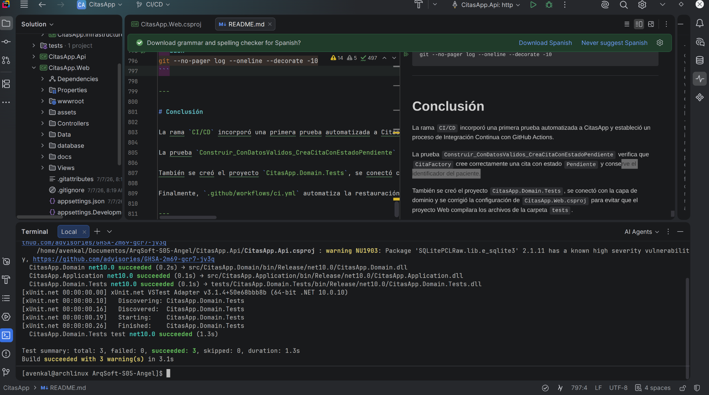
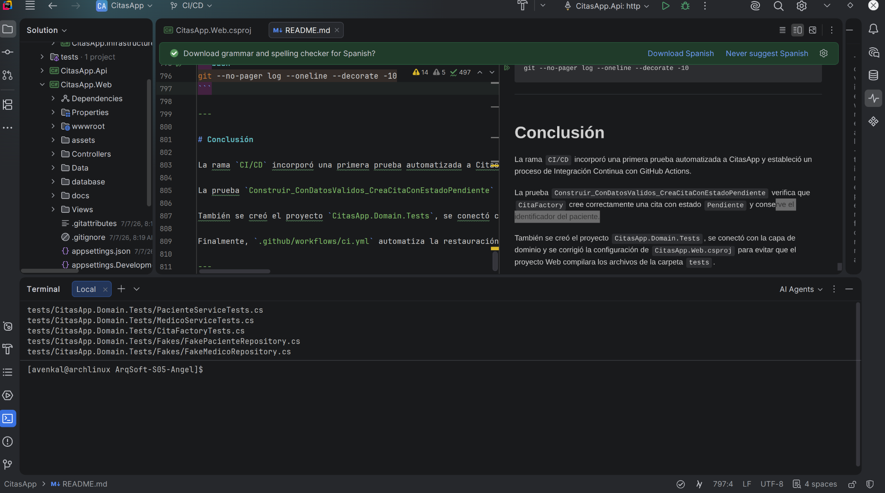
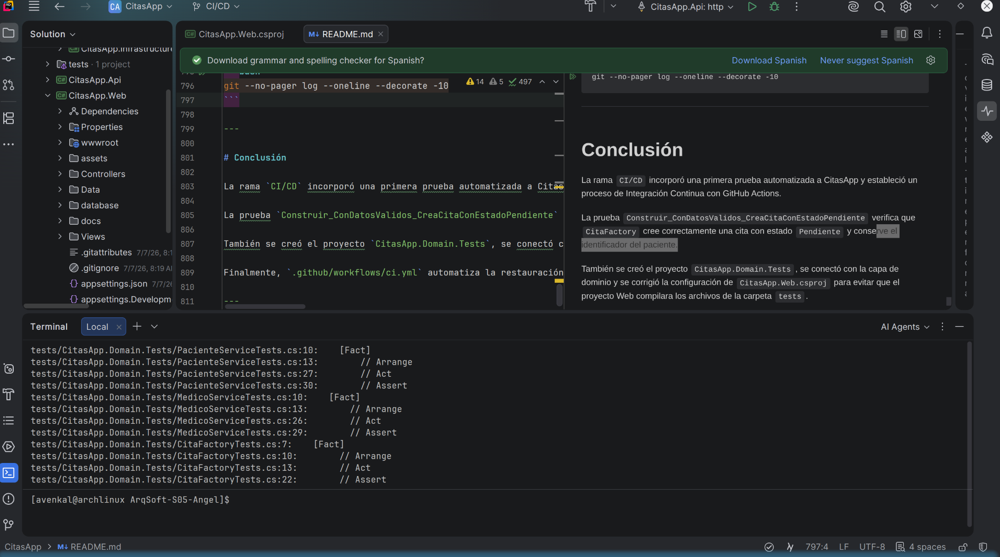

# CitasApp — Refactorización de Code Smells y conexión con PostgreSQL

Este repositorio contiene una aplicación para la gestión de citas médicas desarrollada con **C#, ASP.NET Core MVC, ASP.NET Core Web API y .NET 10**. La solución permite administrar pacientes, médicos y citas, además de consultar información mediante una interfaz Web MVC y una API REST separada.

La rama **`Code-Smell`** está enfocada en dos mejoras principales:

1. Identificar y refactorizar code smells sin cambiar el comportamiento observable del sistema.
2. Preparar la migración del almacenamiento basado en archivos JSON, CSV o SQLite hacia una base de datos PostgreSQL llamada **`CitasAp`**.

La refactorización principal aplica **Dependency Injection** mediante la interfaz `ICitaService`, con el objetivo de reducir el acoplamiento del controlador de citas de la API. La integración con PostgreSQL utiliza **Npgsql**, una cuenta exclusiva para la aplicación y **User Secrets** para evitar almacenar contraseñas dentro del repositorio.

---

## Datos del estudiante

| Campo | Información |
| :--- | :--- |
| **Nombre** | Angel Abraham Lugo Saenz |
| **Matrícula** | SW2409052 |
| **Universidad** | Tecnológico de Software |
| **Profesor** | Jorge Javier Pedroza Romero |
| **Materia** | Arquitectura de Software |
| **Actividad** | Actividad 32 — Code smells, refactorización y persistencia con PostgreSQL |
| **Rama de trabajo** | `Code-Smell` |

---

## Objetivo de la rama `Code-Smell`

El objetivo de esta rama es mejorar la estructura interna de CitasApp sin modificar las funciones que ya utiliza el usuario.

La actividad solicita:

- Identificar al menos dos code smells.
- Aplicar por lo menos una técnica de refactorización.
- Mantener el mismo comportamiento antes y después del cambio.
- Contar con un commit anterior y otro posterior a la refactorización.
- Mostrar mediante el diff que el cambio fue estructural y no una reescritura completa.
- Documentar la deuda técnica identificada.
- Preparar la conexión con PostgreSQL para reemplazar progresivamente la persistencia basada en archivos.

---

## Funcionalidades principales

### Gestión de pacientes

- Consultar pacientes registrados.
- Registrar nuevos pacientes.
- Consultar el detalle de un paciente.
- Obtener pacientes desde endpoints REST.

### Gestión de médicos

- Consultar médicos registrados.
- Registrar nuevos médicos.
- Consultar especialidad y número de licencia.
- Obtener médicos desde endpoints REST.

### Gestión de citas

- Consultar la agenda general.
- Crear nuevas citas.
- Relacionar cada cita con un paciente y un médico.
- Buscar citas por paciente.
- Confirmar citas mediante la API.
- Actualizar el estado de una cita de `Pendiente` a `Confirmada`.

### Notificaciones con Observer

Cuando una cita es confirmada, `CitaService` actualiza su estado y notifica a las implementaciones registradas de `ICitaObserver`:

- `SmsObserver`
- `EmailObserver`

El flujo es el siguiente:

```text
POST /api/Citas/{id}/confirmar
        ↓
CitasController
        ↓
ICitaService
        ↓
CitaService
        ↓
ICitaRepository.Actualizar(cita)
        ↓
ICitaObserver.Notificar(cita)
        ↓
SmsObserver y EmailObserver
```

---

## Tecnologías utilizadas

- **Lenguaje:** C#
- **Framework principal:** ASP.NET Core
- **Aplicación Web:** ASP.NET Core MVC
- **API:** ASP.NET Core Web API
- **Versión del framework:** .NET 10
- **Vistas:** Razor Views
- **Frontend:** HTML, CSS, JavaScript y Bootstrap
- **Base de datos:** PostgreSQL
- **Administrador gráfico:** pgAdmin 4
- **Proveedor de acceso a datos:** Npgsql
- **Persistencia anterior:** JSON, CSV y SQLite
- **Documentación de API:** Swagger / OpenAPI
- **Control de versiones:** Git y GitHub
- **IDE utilizado:** JetBrains Rider
- **Sistema operativo:** Arch Linux
- **Arquitectura:** Separación por capas
- **Patrones utilizados:** Factory, Decorator y Observer
- **Técnica de refactorización aplicada:** Dependency Injection

---

# Actividad 32 — Code smells identificados

## 1. Tight Coupling

### Ubicación

```text
CitasApp.Api/Controllers/CitasController.cs
```

### Problema encontrado

Antes de la refactorización, el controlador dependía directamente de tres clases concretas:

```csharp
private readonly CitaService _citaService;
private readonly PacienteService _pacienteService;
private readonly MedicoService _medicoService;
```

El constructor también recibía los tres servicios:

```csharp
public CitasController(
    CitaService citaService,
    PacienteService pacienteService,
    MedicoService medicoService)
{
    _citaService = citaService;
    _pacienteService = pacienteService;
    _medicoService = medicoService;
}
```

Sin embargo, `PacienteService` y `MedicoService` no eran utilizados por las acciones del controlador. Además, depender directamente de `CitaService` hacía que el controlador conociera una implementación concreta.

### Consecuencias

- Mayor acoplamiento entre el controlador y la capa Application.
- Dependencias innecesarias en el constructor.
- Mayor dificultad para sustituir o probar el servicio.
- El controlador requeriría cambios si se reemplazara la implementación concreta.

### Técnica aplicada

Se aplicó **Dependency Injection basada en una interfaz**.

Se creó:

```text
src/CitasApp.Application/Interfaces/ICitaService.cs
```

La interfaz define las operaciones necesarias:

```csharp
public interface ICitaService
{
    List<Cita> ObtenerTodos();
    List<Cita> ObtenerPorPaciente(int pacienteId);
    void Agregar(Cita cita);
    bool Confirmar(int citaId);
}
```

Después, `CitaService` implementa la interfaz:

```csharp
public class CitaService : ICitaService
```

El controlador ahora depende solamente de la abstracción que utiliza:

```csharp
private readonly ICitaService _citaService;

public CitasController(ICitaService citaService)
{
    _citaService = citaService;
}
```

La implementación concreta se conecta desde `CitasApp.Api/Program.cs`:

```csharp
builder.Services.AddScoped<ICitaService, CitaService>();
```

### Resultado

```text
Antes:
CitasController → CitaService
CitasController → PacienteService sin utilizar
CitasController → MedicoService sin utilizar

Después:
CitasController → ICitaService → CitaService
```

El controlador mantiene los mismos endpoints y respuestas HTTP, pero tiene menos dependencias y menor acoplamiento.

---

## 2. Señal de God Class

### Ubicación

```text
Controllers/CitaController.cs
```

### Problema encontrado

El controlador MVC de citas concentra varias responsabilidades:

- Consulta las citas.
- Consulta pacientes.
- Consulta médicos.
- Prepara información para las vistas.
- Construye valores predeterminados para una cita.
- Valida el formulario.
- Guarda registros.

Aunque la clase todavía no tiene un tamaño extremo, presenta una señal de crecimiento hacia una **God Class**, ya que mezcla presentación, preparación de formularios y acceso a datos.

### Propuesta de mejora

La técnica recomendada es **Extract Class** para mover la preparación del formulario a una clase como:

```text
CitaFormService
```

Esta clase podría encargarse de:

- Obtener pacientes disponibles.
- Obtener médicos disponibles.
- Construir la cita inicial.
- Preparar la información necesaria para las vistas.

La Actividad 32 exige identificar al menos dos code smells y aplicar por lo menos una técnica. En esta rama, la técnica implementada y comprobada es **Dependency Injection** para corregir el Tight Coupling.

---

# Refactorizar no significa reescribir

La refactorización realizada conserva el comportamiento observable del sistema:

- No se modificaron las rutas de la Web MVC.
- No se modificaron los endpoints de la API.
- No se cambiaron los modelos de dominio.
- No se cambiaron los mensajes de respuesta.
- No se modificaron los códigos HTTP.
- No se eliminaron las notificaciones Observer.
- No se cambió la apariencia de la interfaz.

El cambio se realizó en pasos pequeños y quedó dividido en commits para mostrar el estado anterior y posterior.

---

# Deuda técnica identificada

## Qué es

Los controladores conocían demasiados detalles sobre clases concretas y sobre la forma de preparar o consultar los datos.

## Por qué existe

El proyecto fue creciendo a lo largo de varias actividades. Para implementar nuevas funciones rápidamente, algunas dependencias y responsabilidades se agregaron directamente en los controladores.

## Costo de no corregirla

- Los controladores pueden seguir creciendo.
- Las pruebas se vuelven más difíciles.
- Cambiar una implementación concreta puede obligar a modificar varios archivos.
- La persistencia basada en diferentes archivos puede producir datos separados entre la Web y la API.
- Los archivos JSON o CSV no ofrecen el mismo control de integridad que una base de datos relacional.

## Solución aplicada o propuesta

- Dependency Injection mediante `ICitaService`.
- Eliminación de dependencias no utilizadas.
- Extract Class para responsabilidades de formularios.
- PostgreSQL como fuente central de persistencia.
- User Secrets para proteger la cadena de conexión durante el desarrollo.

---

# Migración a PostgreSQL

## Objetivo

La aplicación utilizaba repositorios basados en JSON, CSV y SQLite. La rama `Code-Smell` prepara la migración hacia PostgreSQL para que pacientes, médicos y citas se almacenen en una fuente central.

La base de datos utilizada se llama:

```text
CitasAp
```

El objetivo del cambio es que:

- Los datos iniciales se migren desde los archivos existentes.
- Los nuevos registros se guarden en PostgreSQL.
- La información permanezca disponible después de reiniciar la aplicación.
- La Web MVC y la API puedan trabajar con la misma fuente de datos.
- La contraseña no se almacene en GitHub.

---

## Modelo relacional

### Tabla `pacientes`

| Columna | Tipo | Restricción |
| :--- | :--- | :--- |
| `id` | `INTEGER` | Llave primaria e identidad |
| `nombre` | `VARCHAR(100)` | Obligatorio |
| `apellido` | `VARCHAR(100)` | Obligatorio |
| `email` | `VARCHAR(150)` | Obligatorio |
| `telefono` | `VARCHAR(30)` | Obligatorio |

### Tabla `medicos`

| Columna | Tipo | Restricción |
| :--- | :--- | :--- |
| `id` | `INTEGER` | Llave primaria e identidad |
| `nombre` | `VARCHAR(100)` | Obligatorio |
| `apellido` | `VARCHAR(100)` | Obligatorio |
| `especialidad` | `VARCHAR(150)` | Obligatorio |
| `numero_licencia` | `VARCHAR(80)` | Obligatorio |

### Tabla `citas`

| Columna | Tipo | Restricción |
| :--- | :--- | :--- |
| `id` | `INTEGER` | Llave primaria e identidad |
| `paciente_id` | `INTEGER` | Llave foránea a `pacientes` |
| `medico_id` | `INTEGER` | Llave foránea a `medicos` |
| `fecha` | `DATE` | Obligatorio |
| `hora` | `TIME` | Obligatorio |
| `motivo` | `VARCHAR(500)` | Obligatorio |
| `estado` | `VARCHAR(30)` | Valor inicial `Pendiente` |

Relaciones principales:

```text
pacientes 1 ─── N citas N ─── 1 medicos
```

---

## Script de base de datos

El repositorio incluye el script:

```text
database/01_schema_seed.sql
```

Este archivo se encarga de:

- Crear las tablas `pacientes`, `medicos` y `citas`.
- Crear las claves primarias y foráneas.
- Crear índices para las búsquedas por paciente y médico.
- Insertar los datos iniciales.
- Ajustar las secuencias para generar nuevos IDs.

Para ejecutarlo desde pgAdmin 4:

```text
1. Abrir pgAdmin 4.
2. Seleccionar la base CitasAp.
3. Abrir Tools → Query Tool.
4. Abrir database/01_schema_seed.sql.
5. Ejecutar el script.
6. Actualizar Schemas → public → Tables.
```

Los mensajes como los siguientes son informativos y no representan un error:

```text
NOTICE: relation "pacientes" already exists, skipping
NOTICE: relation "medicos" already exists, skipping
NOTICE: relation "citas" already exists, skipping
```

Aparecen porque el script utiliza `CREATE TABLE IF NOT EXISTS` y puede ejecutarse más de una vez sin volver a crear las tablas.

---

## Verificar los datos en pgAdmin

```sql
SELECT * FROM pacientes ORDER BY id;
SELECT * FROM medicos ORDER BY id;
SELECT * FROM citas ORDER BY id;
```

Consultar las cantidades:

```sql
SELECT
    (SELECT COUNT(*) FROM pacientes) AS pacientes,
    (SELECT COUNT(*) FROM medicos) AS medicos,
    (SELECT COUNT(*) FROM citas) AS citas;
```

Verificar el usuario de la aplicación:

```sql
SELECT rolname
FROM pg_roles
WHERE rolname = 'citasapp_user';
```

---

## Usuario exclusivo para la aplicación

La aplicación no debe conectarse con el usuario administrador `postgres`. Se utiliza una cuenta específica:

```text
citasapp_user
```

Ejemplo para crearla desde pgAdmin:

```sql
CREATE ROLE citasapp_user
WITH LOGIN
PASSWORD 'COLOCA_AQUI_UNA_PASSWORD_SEGURA';
```

Permisos necesarios:

```sql
GRANT CONNECT
ON DATABASE "CitasAp"
TO citasapp_user;

GRANT USAGE
ON SCHEMA public
TO citasapp_user;

GRANT SELECT, INSERT, UPDATE, DELETE
ON ALL TABLES IN SCHEMA public
TO citasapp_user;

GRANT USAGE, SELECT, UPDATE
ON ALL SEQUENCES IN SCHEMA public
TO citasapp_user;
```

La contraseña real no debe agregarse a este archivo ni a ningún commit.

---

# Configuración de Npgsql

Npgsql es el proveedor utilizado para conectar .NET con PostgreSQL.

Instalar el paquete en Infrastructure:

```bash
dotnet add \
  src/CitasApp.Infrastructure/CitasApp.Infrastructure.csproj \
  package Npgsql
```

Restaurar dependencias:

```bash
dotnet restore CitasApp.sln
```

Verificar la referencia:

```bash
grep -n "Npgsql" \
  src/CitasApp.Infrastructure/CitasApp.Infrastructure.csproj
```

---

# Configuración segura con User Secrets

La cadena de conexión no debe escribirse directamente en `Program.cs`, `appsettings.json` o el README.

Inicializar User Secrets para la aplicación Web:

```bash
dotnet user-secrets init \
  --project CitasApp.Web.csproj
```

Inicializar User Secrets para la API:

```bash
dotnet user-secrets init \
  --project CitasApp.Api/CitasApp.Api.csproj
```

Capturar la contraseña sin mostrarla en pantalla:

```bash
read -s -p "Contraseña de citasapp_user: " DB_PASSWORD
echo
```

Guardar la cadena de conexión para la Web:

```bash
dotnet user-secrets set \
  "ConnectionStrings:CitasAppDb" \
  "Host=localhost;Port=5432;Database=CitasAp;Username=citasapp_user;Password=${DB_PASSWORD}" \
  --project CitasApp.Web.csproj
```

Guardar la cadena de conexión para la API:

```bash
dotnet user-secrets set \
  "ConnectionStrings:CitasAppDb" \
  "Host=localhost;Port=5432;Database=CitasAp;Username=citasapp_user;Password=${DB_PASSWORD}" \
  --project CitasApp.Api/CitasApp.Api.csproj
```

Eliminar la variable temporal:

```bash
unset DB_PASSWORD
```

Comprobar que existe la clave:

```bash
dotnet user-secrets list --project CitasApp.Web.csproj
dotnet user-secrets list --project CitasApp.Api/CitasApp.Api.csproj
```

> **Advertencia:** `dotnet user-secrets list` puede mostrar la contraseña en la terminal. No compartas capturas de esa salida.

---

# Flujo esperado con PostgreSQL

```text
Aplicación Web MVC — localhost:5018
        ↓
Controladores MVC
        ↓
Interfaces de repositorio
        ↓
Repositorios PostgreSQL
        ↓
Npgsql
        ↓
Base de datos CitasAp
```

```text
API REST — localhost:5057
        ↓
Controladores API
        ↓
Servicios de Application
        ↓
Interfaces de repositorio
        ↓
Repositorios PostgreSQL
        ↓
Npgsql
        ↓
Base de datos CitasAp
```

Los repositorios PostgreSQL deben implementar las interfaces existentes:

```text
IPacienteRepository
IMedicoRepository
ICitaRepository
```

Esto permite cambiar la fuente de persistencia desde `Program.cs` sin modificar los controladores ni los modelos del dominio.

---

# Arquitectura del proyecto

```text
CitasApp.Web
    ↓
CitasApp.Application
    ↓
CitasApp.Domain
    ↑
CitasApp.Infrastructure

CitasApp.Api
    ↓
CitasApp.Application
    ↓
CitasApp.Domain
    ↑
CitasApp.Infrastructure
```

Responsabilidad de cada capa:

| Capa | Responsabilidad |
| :--- | :--- |
| **CitasApp.Web** | Interfaz MVC, vistas Razor, controladores y navegación |
| **CitasApp.Api** | Endpoints REST y Swagger |
| **CitasApp.Application** | Servicios y casos de uso |
| **CitasApp.Domain** | Modelos e interfaces centrales |
| **CitasApp.Infrastructure** | Repositorios, Npgsql, SQLite, JSON, CSV y observers concretos |

## Diagrama UML por capas

La documentación UML del proyecto se encuentra en:

```text
docs/doc-UML/README.md
```

[Ver documentación UML de CitasApp](docs/doc-UML/README.md)


---

# Estructura principal

```text
ArqSoft-S05-Angel/
│
├── Program.cs
├── CitasApp.Web.csproj
├── CitasApp.sln
├── appsettings.json
├── appsettings.Development.json
│
├── Controllers/
│   ├── HomeController.cs
│   ├── PacienteController.cs
│   ├── MedicoController.cs
│   ├── CitaController.cs
│   ├── ApiPacientesController.cs
│   ├── ApiMedicosController.cs
│   ├── ApiCitasController.cs
│   └── CalculadoraController.cs
│
├── Views/
│   ├── Home/
│   ├── Paciente/
│   ├── Medico/
│   ├── Cita/
│   └── Shared/
│
├── wwwroot/
│   ├── css/
│   ├── js/
│   └── data/
│
├── database/
│   └── 01_schema_seed.sql
│
├── src/
│   ├── CitasApp.Domain/
│   │   ├── Models/
│   │   └── Interfaces/
│   │
│   ├── CitasApp.Application/
│   │   ├── Interfaces/
│   │   │   └── ICitaService.cs
│   │   └── Services/
│   │       ├── PacienteService.cs
│   │       ├── MedicoService.cs
│   │       └── CitaService.cs
│   │
│   └── CitasApp.Infrastructure/
│       ├── Repositories/
│       └── Observers/
│
├── CitasApp.Api/
│   ├── Program.cs
│   ├── CitasApp.Api.csproj
│   ├── Controllers/
│   └── Data/
│
├── docs/
│   ├── Actividad32-CodeSmells.md
│   └── doc-UML/
│
├── assets/
└── README.md
```

---

# Patrones y principios aplicados

## Factory

`RepositoryFactory` permite seleccionar una implementación de repositorio sin crearla directamente desde los controladores.

## Decorator

`LoggingPacienteRepository` envuelve un repositorio de pacientes para agregar comportamiento de registro sin modificar la implementación original.

## Observer

`CitaService` notifica a `SmsObserver` y `EmailObserver` cuando una cita es confirmada.

## Dependency Injection

Los controladores y servicios reciben sus dependencias desde `Program.cs`.

Ejemplo de la refactorización:

```csharp
builder.Services.AddScoped<ICitaService, CitaService>();
```

## Inversión de dependencias

Application trabaja con interfaces de Domain y no necesita crear directamente repositorios u observers concretos.

---

# Puertos de ejecución

La solución contiene dos proyectos ejecutables distintos.

| Proyecto | Dirección | Uso |
| :--- | :--- | :--- |
| **CitasApp.Web** | `http://localhost:5018` | Interfaz gráfica MVC |
| **CitasApp.Api** | `http://localhost:5057` | API REST |
| **Swagger** | `http://localhost:5057/swagger` | Documentación y pruebas de la API |

Abrir `localhost:5057` muestra solamente el mensaje principal de la API. La interfaz gráfica y el menú de navegación se encuentran en `localhost:5018`.

---

# Comandos principales

## Verificar la rama

```bash
git branch --show-current
```

Resultado esperado:

```text
Code-Smell
```

## Restaurar dependencias

```bash
dotnet restore CitasApp.sln
```

## Limpiar la solución

```bash
dotnet clean CitasApp.sln
```

## Compilar

```bash
dotnet build CitasApp.sln
```

Resultado esperado:

```text
Build succeeded.
```

## Ejecutar la Web MVC

```bash
dotnet run \
  --project CitasApp.Web.csproj \
  --launch-profile http
```

Abrir:

```text
http://localhost:5018
```

Rutas principales:

```text
http://localhost:5018/
http://localhost:5018/Paciente
http://localhost:5018/Medico
http://localhost:5018/Cita
http://localhost:5018/Cita/Create
```

## Ejecutar la API

```bash
dotnet run \
  --project CitasApp.Api/CitasApp.Api.csproj \
  --launch-profile http
```

Abrir:

```text
http://localhost:5057
http://localhost:5057/swagger
```

## Probar endpoints

```bash
curl -i http://localhost:5057/api/Pacientes
curl -i http://localhost:5057/api/Medicos
curl -i http://localhost:5057/api/Citas
curl -i http://localhost:5057/api/Citas/porpaciente/1
```

Confirmar una cita:

```bash
curl -i -X POST \
  http://localhost:5057/api/Citas/1/confirmar
```

Respuesta esperada:

```json
{
  "mensaje": "Cita confirmada y notificaciones enviadas"
}
```

---

# Comprobar PostgreSQL desde la terminal

Conectarse a la base:

```bash
psql -h localhost -p 5432 -U citasapp_user -d CitasAp
```

Después de ingresar la contraseña:

```sql
SELECT current_database(), current_user;
```

Resultado esperado:

```text
current_database | current_user
-----------------+----------------
CitasAp          | citasapp_user
```

Listar tablas:

```text
\dt
```

Consultar registros:

```sql
SELECT COUNT(*) FROM pacientes;
SELECT COUNT(*) FROM medicos;
SELECT COUNT(*) FROM citas;
```

Salir de `psql`:

```text
\q
```

---

# Prueba de persistencia

Para comprobar que los registros se guardan realmente en PostgreSQL:

1. Ejecutar la aplicación Web en `localhost:5018`.
2. Registrar un paciente, médico o cita desde la interfaz.
3. Consultar la tabla correspondiente en pgAdmin.
4. Detener la aplicación.
5. Iniciar nuevamente la Web.
6. Confirmar que el registro continúa disponible.

Consulta recomendada:

```sql
SELECT *
FROM pacientes
ORDER BY id;
```

La permanencia del registro después de reiniciar la aplicación demuestra que el dato está almacenado en PostgreSQL y no solamente en memoria.

---

# Gestión de commits

La rama utiliza commits intermedios para evidenciar el avance.

Secuencia esperada:

```text
docs: identificar code smells antes de refactorizar
refactor: desacoplar CitasController mediante ICitaService
database: crear esquema PostgreSQL y migrar datos iniciales
chore: agregar Npgsql y configurar secretos de conexion
```

Consultar el historial:

```bash
git --no-pager log --oneline --decorate -10
```

Revisar el diff de un commit:

```bash
git --no-pager show HEAD
```

Revisar solamente los archivos modificados:

```bash
git --no-pager show --stat HEAD
```

Flujo normal para un nuevo commit:

```bash
git status
git add .
git status
git commit -m "descripcion del cambio"
git push
```

Aunque `git add .` puede utilizarse, siempre debe revisarse `git status` antes del commit para evitar agregar bases locales, carpetas `bin`, `obj`, configuraciones de Rider o archivos temporales.

---

# Error de paginador `less` en Arch Linux

Si Git muestra:

```text
error: cannot run less: No such file or directory
fatal: unable to execute pager 'less'
```

Se puede instalar `less`:

```bash
sudo pacman -S less
```

También se puede ejecutar Git sin paginador:

```bash
git --no-pager log --oneline
```

O configurar `cat` como paginador global:

```bash
git config --global core.pager cat
```

---

# Uso en JetBrains Rider

```text
1. Abrir JetBrains Rider.
2. Seleccionar Open.
3. Abrir la carpeta ArqSoft-S05-Angel o el archivo CitasApp.sln.
4. Esperar la restauración de dependencias.
5. Abrir la terminal integrada.
6. Verificar que la rama activa sea Code-Smell.
7. Compilar con dotnet build CitasApp.sln.
8. Ejecutar CitasApp.Web para utilizar la interfaz gráfica.
9. Ejecutar CitasApp.Api para utilizar Swagger o los endpoints REST.
10. Mantener PostgreSQL activo antes de ejecutar los proyectos que dependan de la base.
```

---

# Requisitos en Arch Linux

## .NET SDK

```bash
sudo pacman -S dotnet-sdk
```

Verificar:

```bash
dotnet --list-sdks
dotnet --list-runtimes
```

## PostgreSQL

```bash
sudo pacman -S postgresql
```

Comprobar el servicio:

```bash
systemctl status postgresql
```

Iniciar el servicio cuando sea necesario:

```bash
sudo systemctl start postgresql
```

Habilitarlo al iniciar el sistema:

```bash
sudo systemctl enable postgresql
```

## pgAdmin 4

pgAdmin se utiliza para crear la base `CitasAp`, ejecutar los scripts SQL, revisar tablas y comprobar los registros guardados por la aplicación.

---

# Seguridad

- No guardar contraseñas dentro de `Program.cs`.
- No guardar contraseñas dentro de `appsettings.json`.
- No agregar credenciales al README.
- No subir salidas de `dotnet user-secrets list`.
- Usar `citasapp_user` en lugar del administrador `postgres`.
- Revisar `git diff` antes de cada commit.
- Mantener `bin/`, `obj/`, `.idea/` y bases locales fuera de Git cuando corresponda.

Comprobar que no se escribió accidentalmente una contraseña:

```bash
git grep -n "Password="
```

---

# Solución de problemas

## La interfaz gráfica no aparece

Probablemente se está ejecutando la API en `5057`.

Ejecutar la Web:

```bash
dotnet run \
  --project CitasApp.Web.csproj \
  --launch-profile http
```

Abrir:

```text
http://localhost:5018
```

## La aplicación no encuentra la conexión

Verificar los secretos:

```bash
dotnet user-secrets list --project CitasApp.Web.csproj
dotnet user-secrets list --project CitasApp.Api/CitasApp.Api.csproj
```

La clave debe llamarse:

```text
ConnectionStrings:CitasAppDb
```

## PostgreSQL rechaza la conexión

Comprobar:

```bash
systemctl status postgresql
```

Después probar directamente:

```bash
psql -h localhost -p 5432 -U citasapp_user -d CitasAp
```

## Las tablas no aparecen en pgAdmin

Actualizar:

```text
CitasAp → Schemas → public → Tables → Refresh
```

## El script muestra `relation already exists`

Es un `NOTICE`, no un error. El script evita duplicar tablas e índices existentes.

---

# Evidencias de ejecución

Las imágenes existentes del proyecto se conservan dentro de la carpeta `assets/` y se muestran a continuación.

## Página principal y panel de endpoints

Esta captura muestra la página principal de CitasApp con el panel para probar los endpoints disponibles.



## Comprobación del patrón Observer

Esta evidencia muestra la comprobación por terminal del comportamiento relacionado con las notificaciones de citas.



## Interfaz Web de CitasApp

Esta captura muestra la aplicación Web MVC funcionando con su menú de navegación y las vistas del sistema.



## Evidencias adicionales recomendadas para la rama `Code-Smell`

También pueden agregarse capturas de:

- Rama `Code-Smell` activa.
- Historial con el commit anterior y el commit posterior a la refactorización.
- Diff donde `CitasController` cambia de `CitaService` a `ICitaService`.
- Compilación exitosa de `CitasApp.sln`.
- Interfaz Web funcionando en `localhost:5018`.
- Swagger funcionando en `localhost:5057/swagger`.
- Tablas `pacientes`, `medicos` y `citas` en pgAdmin 4.
- Consulta SQL mostrando los datos migrados desde los archivos originales.
- Registro creado desde la Web y visible posteriormente en PostgreSQL.

---

# Mejoras futuras

```text
[ ] Aplicar Extract Class en Controllers/CitaController.cs.

[ ] Crear CitaFormService para preparar formularios y catálogos.

[ ] Agregar validaciones con Data Annotations.

[ ] Evitar citas duplicadas para un médico en la misma fecha y hora.

[ ] Agregar edición y eliminación de pacientes.

[ ] Agregar edición y eliminación de médicos.

[ ] Agregar edición y eliminación de citas.

[ ] Agregar migraciones versionadas para cambios futuros del esquema.

[ ] Agregar pruebas unitarias para ICitaService y CitaService.

[ ] Agregar pruebas de integración con PostgreSQL.

[ ] Implementar notificaciones reales de correo y SMS.

[ ] Evitar notificar nuevamente una cita ya confirmada.

[ ] Centralizar el manejo de errores de conexión.

[ ] Agregar variables de entorno para despliegue fuera del entorno local.
```

---

# Conclusión

La rama `Code-Smell` permitió revisar la estructura interna de CitasApp y aplicar una refactorización sin cambiar las funciones del sistema.

Se identificó Tight Coupling en el controlador de citas de la API y se corrigió mediante la interfaz `ICitaService` y Dependency Injection. También se documentó una señal de God Class en el controlador MVC de citas y se propuso Extract Class como mejora posterior.

Además, se creó la base PostgreSQL `CitasAp`, se definieron las tablas y relaciones necesarias, se migraron los datos iniciales y se configuró Npgsql junto con User Secrets para mantener la contraseña fuera del repositorio.

La separación mediante interfaces permite sustituir progresivamente los repositorios basados en archivos por repositorios PostgreSQL sin modificar los controladores ni los modelos de dominio. De esta forma, la aplicación conserva su comportamiento mientras mejora el desacoplamiento, la seguridad y la persistencia de datos.

---

## Cláusula de IA

```text
Yo, Angel Abraham Lugo Saenz, declaro que utilicé IA como apoyo para organizar y redactar este README, documentar los code smells identificados, explicar la refactorización mediante Dependency Injection y describir la configuración de PostgreSQL y Npgsql.

El código, la estructura del proyecto, las pruebas, la configuración local de la base de datos y las decisiones principales fueron revisadas y ejecutadas como parte de la actividad escolar de Arquitectura de Software.
```
