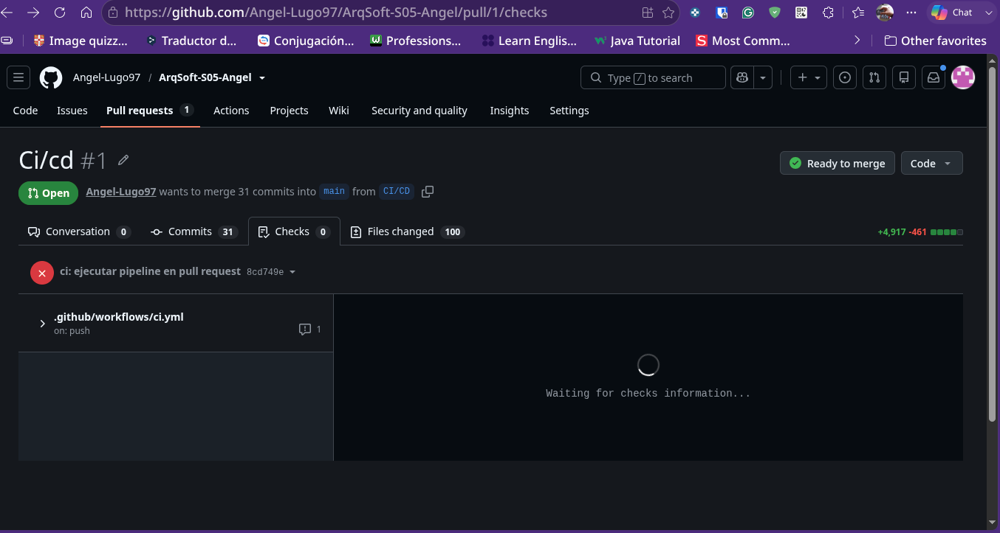

# CitasApp — Pruebas xUnit e Integración Continua con GitHub Actions

Este repositorio contiene una aplicación para la gestión de citas médicas desarrollada con **C#, ASP.NET Core MVC, ASP.NET Core Web API y .NET 10**.

La rama **`CI/CD`** está enfocada en incorporar pruebas unitarias con **xUnit** y un flujo de **Integración Continua con GitHub Actions**, de modo que cada cambio enviado al repositorio sea restaurado, compilado y probado automáticamente.

En esta rama se agregaron pruebas para tres clases del proyecto:

1. `CitaFactory`
2. `PacienteService`
3. `MedicoService`

Además, se configuró un workflow que ejecuta las pruebas en cada `push` y Pull Request, y se provocó una falla intencional para comprobar que el pipeline puede detectar errores y mostrarlos en rojo.

---

## Datos del estudiante

| Campo | Información |
| :--- | :--- |
| **Nombre** | Angel Abraham Lugo Saenz |
| **Matrícula** | SW2409052 |
| **Universidad** | Tecnológico de Software |
| **Profesor** | Jorge Javier Pedroza Romero |
| **Materia** | Arquitectura de Software |
| **Actividad** | Actividad 35 — Pruebas xUnit e Integración Continua |
| **Rama de trabajo** | `CI/CD` |

---

# Requisitos de la Actividad 35

| Requisito | Implementación |
| :--- | :--- |
| Pruebas xUnit para al menos tres clases | `CitaFactoryTests`, `PacienteServiceTests` y `MedicoServiceTests` |
| Uso de `[Fact]` | Cada clase de prueba contiene al menos un método marcado con `[Fact]` |
| Uso de Arrange, Act y Assert | Las tres pruebas están divididas claramente en las tres etapas |
| Workflow de GitHub Actions | `.github/workflows/ci.yml` |
| Ejecución en cada `push` | Configurada mediante el evento `push` |
| Ejecución en Pull Requests | Configurada mediante el evento `pull_request` |
| Compilación automática | `dotnet build CitasApp.sln` |
| Ejecución automática de pruebas | `dotnet test CitasApp.sln` |
| Pull Request real | Pull Request de la rama `CI/CD` hacia `main` |
| Pipeline rojo con falla intencional | Se modificó temporalmente una aserción de `PacienteServiceTests` |
| Recuperación del pipeline | Se revirtió el fallo y las tres pruebas volvieron a pasar |

---

# Objetivo de la rama `CI/CD`

El objetivo de esta rama es comprobar automáticamente que los cambios realizados en CitasApp no rompan el comportamiento esperado del sistema.

La rama incorpora:

- Pruebas unitarias con xUnit
- Tres clases del proyecto bajo prueba
- Estructura Arrange, Act y Assert
- Repositorios falsos para probar servicios sin utilizar PostgreSQL
- Un proyecto de pruebas independiente
- Integración Continua mediante GitHub Actions
- Ejecución automática en cada `push`
- Ejecución automática en cada Pull Request
- Una prueba fallida intencionalmente para evidenciar el funcionamiento del pipeline

El flujo general es:

```text
Cambio en el código
        ↓
git add y git commit
        ↓
git push
        ↓
GitHub Actions detecta el cambio
        ↓
Configura .NET 10
        ↓
Restaura dependencias
        ↓
Compila CitasApp.sln
        ↓
Ejecuta las pruebas xUnit
        ↓
Resultado del pipeline
        │
        ├── Pruebas correctas → check verde
        │
        └── Prueba incorrecta → check rojo
```

---

# ¿Qué es una prueba unitaria?

Una prueba unitaria comprueba una parte pequeña y específica del código.

Cada prueba escrita en esta rama representa una promesa sobre el comportamiento del sistema.

```text
CitaFactory:
Si recibe datos válidos, debe crear una cita en estado Pendiente.

PacienteService:
Si el repositorio contiene un paciente, debe devolver el paciente correcto.

MedicoService:
Si recibe un médico válido, debe guardarlo en el repositorio.
```

Estas pruebas pueden ejecutarse en segundos y repetirse después de cualquier modificación.

---

# Proyecto de pruebas

Las pruebas se encuentran en:

```text
tests/CitasApp.Domain.Tests/
```

El proyecto fue creado con xUnit y se agregó a `CitasApp.sln`.

Dependencias principales:

```text
CitasApp.Domain.Tests
        ├── CitasApp.Domain
        └── CitasApp.Application
```

Referencias utilizadas:

```bash
dotnet add \
  tests/CitasApp.Domain.Tests/CitasApp.Domain.Tests.csproj \
  reference src/CitasApp.Domain/CitasApp.Domain.csproj
```

```bash
dotnet add \
  tests/CitasApp.Domain.Tests/CitasApp.Domain.Tests.csproj \
  reference src/CitasApp.Application/CitasApp.Application.csproj
```

Agregar el proyecto a la solución:

```bash
dotnet sln CitasApp.sln add \
  tests/CitasApp.Domain.Tests/CitasApp.Domain.Tests.csproj
```

---

# Arrange, Act y Assert

Las pruebas utilizan el patrón **Arrange, Act, Assert**, también conocido como AAA.

| Etapa | Qué hace |
| :--- | :--- |
| **Arrange** | Prepara objetos, servicios, repositorios y datos |
| **Act** | Ejecuta el método que se desea probar |
| **Assert** | Compara el resultado real con el resultado esperado |

Ejemplo general:

```csharp
[Fact]
public void Metodo_Condicion_ResultadoEsperado()
{
    // Arrange
    var objeto = new ClaseAProbar();

    // Act
    var resultado = objeto.Ejecutar();

    // Assert
    Assert.NotNull(resultado);
}
```

---

# Prueba 1 — `CitaFactoryTests`

Archivo:

```text
tests/CitasApp.Domain.Tests/CitaFactoryTests.cs
```

Clase probada:

```text
src/CitasApp.Domain/Factories/CitaFactory.cs
```

La prueba verifica que `CitaFactory` construya una cita con estado inicial `Pendiente` y conserve el identificador del paciente.

```csharp
using CitasApp.Factories;

namespace CitasApp.Domain.Tests;

public class CitaFactoryTests
{
    [Fact]
    public void Construir_ConDatosValidos_CreaCitaConEstadoPendiente()
    {
        // Arrange
        var factory = new CitaFactory();

        // Act
        var cita = factory.Construir(
            pacienteId: 1,
            medicoId: 2,
            fecha: new DateOnly(2026, 7, 20),
            hora: new TimeOnly(10, 0),
            motivo: "Consulta"
        );

        // Assert
        Assert.Equal("Pendiente", cita.Estado);
        Assert.Equal(1, cita.PacienteId);
    }
}
```

Promesa verificada:

```text
Si CitaFactory recibe datos válidos,
la cita debe tener Estado = "Pendiente"
y PacienteId = 1.
```

---

# Prueba 2 — `PacienteServiceTests`

Archivo:

```text
tests/CitasApp.Domain.Tests/PacienteServiceTests.cs
```

Clase probada:

```text
src/CitasApp.Application/Services/PacienteService.cs
```

Esta prueba utiliza `FakePacienteRepository` para preparar un paciente en memoria y comprobar que el servicio devuelva el registro correcto.

```csharp
using CitasApp.Application.Services;
using CitasApp.Domain.Tests.Fakes;
using CitasApp.Models;
using Xunit;

namespace CitasApp.Domain.Tests;

public class PacienteServiceTests
{
    [Fact]
    public void ObtenerPorId_ConPacienteExistente_RegresaPacienteCorrecto()
    {
        // Arrange
        var repositorio = new FakePacienteRepository();

        repositorio.Pacientes.Add(new Paciente
        {
            Id = 1,
            Nombre = "Ana",
            Apellido = "Martínez",
            Email = "ana@example.com",
            Telefono = "9991234567"
        });

        var servicio = new PacienteService(repositorio);

        // Act
        var paciente = servicio.ObtenerPorId(1);

        // Assert
        Assert.NotNull(paciente);
        Assert.Equal(1, paciente.Id);
        Assert.Equal("Ana", paciente.Nombre);
    }
}
```

Promesa verificada:

```text
Si existe un paciente con Id = 1,
PacienteService debe devolver ese paciente
con Nombre = "Ana".
```

---

# Prueba 3 — `MedicoServiceTests`

Archivo:

```text
tests/CitasApp.Domain.Tests/MedicoServiceTests.cs
```

Clase probada:

```text
src/CitasApp.Application/Services/MedicoService.cs
```

Esta prueba utiliza `FakeMedicoRepository` para comprobar que el servicio guarde correctamente un médico.

```csharp
using CitasApp.Application.Services;
using CitasApp.Domain.Tests.Fakes;
using CitasApp.Models;
using Xunit;

namespace CitasApp.Domain.Tests;

public class MedicoServiceTests
{
    [Fact]
    public void Agregar_ConMedicoValido_GuardaMedicoEnRepositorio()
    {
        // Arrange
        var repositorio = new FakeMedicoRepository();
        var servicio = new MedicoService(repositorio);

        var medico = new Medico
        {
            Id = 2,
            Nombre = "Carlos",
            Apellido = "López",
            Especialidad = "Cardiología",
            NumeroLicencia = "MED-2026-001"
        };

        // Act
        servicio.Agregar(medico);

        // Assert
        Assert.Single(repositorio.Medicos);
        Assert.Equal(2, repositorio.Medicos[0].Id);
        Assert.Equal("Cardiología", repositorio.Medicos[0].Especialidad);
    }
}
```

Promesa verificada:

```text
Si MedicoService recibe un médico válido,
debe agregar un único registro al repositorio
y conservar su Id y especialidad.
```

---

# Repositorios falsos

Para probar `PacienteService` y `MedicoService` sin conectarse a PostgreSQL se agregaron repositorios falsos que trabajan únicamente en memoria.

Archivos:

```text
tests/CitasApp.Domain.Tests/Fakes/FakePacienteRepository.cs
tests/CitasApp.Domain.Tests/Fakes/FakeMedicoRepository.cs
```

Flujo de una prueba con repositorio falso:

```text
Prueba xUnit
      ↓
Servicio de Application
      ↓
Interfaz del repositorio
      ↓
Repositorio falso en memoria
```

Esto permite que las pruebas sean rápidas, repetibles e independientes de la base de datos.

---

# Resultado de las pruebas

Comando utilizado:

```bash
dotnet test \
  CitasApp.sln \
  --configuration Release \
  --verbosity normal
```

Resultado correcto:

```text
Test summary: total: 3, failed: 0, succeeded: 3, skipped: 0
Build succeeded
```

Esto demuestra que las tres clases de prueba fueron descubiertas y ejecutadas correctamente.

---

# Integración Continua

La Integración Continua, conocida como **CI**, permite verificar automáticamente cada cambio enviado al repositorio.

En este proyecto responde la pregunta:

```text
¿El cambio que acabo de subir rompió algo?
```

GitHub Actions ejecuta:

```text
1. Descargar el repositorio
2. Configurar .NET 10
3. Restaurar dependencias
4. Compilar la solución
5. Ejecutar las pruebas xUnit
```

---

# Diferencia entre CI y CD

| Concepto | Descripción | Pregunta que responde |
| :--- | :--- | :--- |
| **CI** | Compila y ejecuta pruebas automáticamente | ¿Mi cambio rompió algo? |
| **CD** | Entrega o despliega automáticamente el sistema | ¿Mi cambio ya está publicado? |

La automatización implementada en esta actividad se concentra en **CI**. El despliegue automático queda como mejora futura.

---

# GitHub Actions

El workflow se encuentra en:

```text
.github/workflows/ci.yml
```

Contenido:

```yaml
name: CI

on:
  push:
  pull_request:
  workflow_dispatch:

permissions:
  contents: read

jobs:
  test:
    name: Compilar y ejecutar pruebas
    runs-on: ubuntu-latest

    steps:
      - name: Descargar repositorio
        uses: actions/checkout@v4

      - name: Configurar .NET 10
        uses: actions/setup-dotnet@v4
        with:
          dotnet-version: '10.0.x'

      - name: Mostrar versión de .NET
        run: dotnet --version

      - name: Restaurar dependencias
        run: dotnet restore CitasApp.sln

      - name: Compilar solución
        run: dotnet build CitasApp.sln --configuration Release --no-restore

      - name: Ejecutar todas las pruebas xUnit
        run: dotnet test CitasApp.sln --configuration Release --no-build --verbosity normal
```

El workflow utiliza .NET 10 porque los proyectos están configurados con:

```xml
<TargetFramework>net10.0</TargetFramework>
```

---

# Eventos que activan el workflow

```yaml
on:
  push:
  pull_request:
  workflow_dispatch:
```

| Evento | Función |
| :--- | :--- |
| `push` | Ejecuta CI cuando se sube un commit |
| `pull_request` | Ejecuta CI cuando se crea o actualiza un Pull Request |
| `workflow_dispatch` | Permite ejecutar el workflow manualmente desde GitHub |

---

# Pull Request real

La rama utilizada es:

```text
CI/CD
```

El Pull Request tiene como destino:

```text
main
```

Flujo:

```text
CI/CD
   ↓
Pull Request
   ↓
GitHub Actions
   ↓
Compilación y pruebas
   ↓
Resultado del check
```

El Pull Request permite comprobar el estado del pipeline antes de mezclar los cambios con la rama principal.

---

# Prueba fallida intencionalmente

Para comprobar que GitHub Actions detecta errores se modificó temporalmente la aserción de `PacienteServiceTests`.

Aserción correcta:

```csharp
Assert.Equal("Ana", paciente.Nombre);
```

Aserción utilizada para provocar el fallo:

```csharp
Assert.Equal("NombreIncorrecto", paciente.Nombre);
```

Resultado:

```text
Expected: "NombreIncorrecto"
Actual:   "Ana"

Test summary: total: 3, failed: 1, succeeded: 2, skipped: 0
```

El fallo demuestra que el pipeline no solamente compila el proyecto, sino que también detecta cuando el resultado real no coincide con la promesa escrita en la prueba.

Después de obtener la evidencia se revirtió el commit y las pruebas regresaron a:

```text
total: 3
failed: 0
succeeded: 3
skipped: 0
```

---

# Arquitectura del proyecto

```text
CitasApp.Web
    ↓
CitasApp.Application
    ↓
CitasApp.Domain
    ↑
CitasApp.Infrastructure

CitasApp.Api
    ↓
CitasApp.Application
    ↓
CitasApp.Domain
    ↑
CitasApp.Infrastructure

CitasApp.Domain.Tests
    ├── CitasApp.Application
    └── CitasApp.Domain
```

| Capa | Responsabilidad |
| :--- | :--- |
| **CitasApp.Web** | Interfaz MVC, vistas Razor y controladores |
| **CitasApp.Api** | Endpoints REST y Swagger |
| **CitasApp.Application** | Servicios y casos de uso |
| **CitasApp.Domain** | Modelos, interfaces y `CitaFactory` |
| **CitasApp.Infrastructure** | Repositorios, PostgreSQL, SQLite y observers |
| **CitasApp.Domain.Tests** | Pruebas unitarias y repositorios falsos |
| **GitHub Actions** | Compilación y ejecución automática de pruebas |

## Diagrama UML por capas

La documentación UML existente se conserva en:

```text
docs/doc-UML/README.md
```

[Ver documentación UML de CitasApp](docs/doc-UML/README.md)


---

# Estructura principal

```text
ArqSoft-S05-Angel/
│
├── .github/
│   └── workflows/
│       └── ci.yml
│
├── tests/
│   └── CitasApp.Domain.Tests/
│       ├── Fakes/
│       │   ├── FakePacienteRepository.cs
│       │   └── FakeMedicoRepository.cs
│       ├── CitaFactoryTests.cs
│       ├── PacienteServiceTests.cs
│       ├── MedicoServiceTests.cs
│       └── CitasApp.Domain.Tests.csproj
│
├── src/
│   ├── CitasApp.Domain/
│   │   ├── Factories/
│   │   │   └── CitaFactory.cs
│   │   ├── Models/
│   │   └── Interfaces/
│   │
│   ├── CitasApp.Application/
│   │   └── Services/
│   │       ├── PacienteService.cs
│   │       └── MedicoService.cs
│   │
│   └── CitasApp.Infrastructure/
│
├── CitasApp.Api/
├── Controllers/
├── Views/
├── wwwroot/
├── database/
├── docs/
├── assets/
│   ├── 1.png
│   ├── 2.png
│   ├── 3.png
│   └── 5.png
├── CitasApp.Web.csproj
├── CitasApp.sln
└── README.md
```

---

# Exclusión de la carpeta de pruebas

Como `CitasApp.Web.csproj` está en la raíz del repositorio, podía intentar compilar automáticamente los archivos `.cs` ubicados en `tests/`.

Para separar correctamente el proyecto Web y el proyecto xUnit se agregó:

```xml
<ItemGroup>
  <Compile Remove="tests/**/*.cs" />
  <Content Remove="tests/**" />
  <None Remove="tests/**" />
  <EmbeddedResource Remove="tests/**" />
</ItemGroup>
```

Esto evita errores como:

```text
Duplicate AssemblyAttribute
Duplicate TargetFrameworkAttribute
The type or namespace name 'Xunit' could not be found
```

---

# Tecnologías utilizadas

- **Lenguaje:** C#
- **Framework:** ASP.NET Core
- **Versión:** .NET 10
- **Aplicación Web:** ASP.NET Core MVC
- **API:** ASP.NET Core Web API
- **Pruebas:** xUnit
- **Estructura de pruebas:** Arrange, Act y Assert
- **Automatización:** GitHub Actions
- **Runner:** Ubuntu Latest
- **Control de versiones:** Git y GitHub
- **IDE:** JetBrains Rider
- **Sistema operativo local:** Arch Linux
- **Arquitectura:** Separación por capas
- **Base de datos:** PostgreSQL
- **Proveedor:** Npgsql

---

# Comandos principales

## Verificar la rama

```bash
git branch --show-current
```

Resultado esperado:

```text
CI/CD
```

## Restaurar dependencias

```bash
dotnet restore CitasApp.sln
```

## Limpiar la solución

```bash
dotnet clean CitasApp.sln
```

## Compilar

```bash
dotnet build \
  CitasApp.sln \
  --configuration Release \
  --no-restore
```

## Ejecutar todas las pruebas

```bash
dotnet test \
  CitasApp.sln \
  --configuration Release \
  --verbosity normal
```

Resultado esperado:

```text
Test summary: total: 3, failed: 0, succeeded: 3, skipped: 0
```

## Listar las pruebas

```bash
dotnet test \
  tests/CitasApp.Domain.Tests/CitasApp.Domain.Tests.csproj \
  --list-tests
```

## Comprobar `[Fact]` y AAA

```bash
grep -R -n \
  "\[Fact\]\|// Arrange\|// Act\|// Assert" \
  tests/CitasApp.Domain.Tests \
  --include="*Tests.cs"
```

## Mostrar los archivos de pruebas

```bash
find tests/CitasApp.Domain.Tests \
  -maxdepth 2 \
  -type f \
  \( -name "*Tests.cs" -o -name "Fake*Repository.cs" \) \
  -print
```

---

# Subir cambios

```bash
git status
git add .
git status
git commit -m "docs: actualizar evidencias de pruebas y CI"
git push
```

---

# Permisos del token

Para modificar `.github/workflows/ci.yml`, el Personal Access Token clásico necesita:

```text
repo
workflow
```

No necesita:

```text
write:packages
delete:packages
admin:org
delete_repo
```

---

# Advertencia de SQLite

Durante la compilación puede aparecer:

```text
warning NU1903:
Package 'SQLitePCLRaw.lib.e_sqlite3' 2.1.11
has a known high severity vulnerability
```

Esta advertencia no impide actualmente la compilación ni la ejecución de las pruebas, pero debe atenderse posteriormente mediante una actualización o sustitución del paquete.

---

# Evidencias de la Actividad 35

Las siguientes imágenes deben encontrarse dentro de:

```text
assets/
```

Las rutas usadas en este README son relativas, de manera que GitHub pueda mostrar las capturas correctamente.

## Evidencia 1 — Ejecución exitosa de las tres pruebas xUnit

La captura muestra la ejecución local desde la terminal de JetBrains Rider y confirma que las pruebas de `CitaFactory`, `PacienteService` y `MedicoService` terminaron correctamente.

Resultado visible:

```text
total: 3
failed: 0
succeeded: 3
skipped: 0
```


---

## Evidencia 2 — Archivos de las pruebas y repositorios falsos

La captura muestra los tres archivos de pruebas y los dos repositorios falsos utilizados para ejecutar las pruebas de servicios sin acceder a PostgreSQL.

Archivos mostrados:

```text
PacienteServiceTests.cs
MedicoServiceTests.cs
CitaFactoryTests.cs
FakePacienteRepository.cs
FakeMedicoRepository.cs
```


---

## Evidencia 3 — Comprobación de `[Fact]` y Arrange, Act, Assert

La captura comprueba mediante terminal que las tres clases de prueba contienen:

```text
[Fact]
// Arrange
// Act
// Assert
```

Esto demuestra que cada prueba sigue la estructura solicitada por la actividad.


---

## Evidencia 4 — Pipeline de GitHub Actions en un Pull Request real

La captura muestra el Pull Request de la rama `CI/CD` hacia `main` y la sección de comprobaciones asociada al workflow.

El pipeline debe ejecutar:

```text
Restaurar dependencias
Compilar CitasApp.sln
Ejecutar las tres pruebas xUnit
```



> Para la evidencia final del profesor conviene conservar también una captura del check verde y otra del check rojo generado por la prueba fallida intencionalmente.

---

# Evidencia del pipeline rojo

Para provocar el error se cambió temporalmente:

```csharp
Assert.Equal("Ana", paciente.Nombre);
```

por:

```csharp
Assert.Equal("NombreIncorrecto", paciente.Nombre);
```

El resultado esperado del fallo es:

```text
Expected: "NombreIncorrecto"
Actual:   "Ana"

Test summary: total: 3, failed: 1, succeeded: 2, skipped: 0
```

Después de tomar la captura, el cambio se revirtió para dejar nuevamente las tres pruebas correctas.

---

# Solución de problemas

## El proyecto Web intenta compilar archivos xUnit

Verificar que `CitasApp.Web.csproj` tenga la exclusión de `tests/**`.

Después limpiar:

```bash
find . -type d \( -name bin -o -name obj \) \
  -prune \
  -exec rm -rf {} +
```

Restaurar y compilar:

```bash
dotnet restore CitasApp.sln
dotnet build CitasApp.sln --no-restore
```

## GitHub no ejecuta el workflow

```bash
ls -la .github/workflows
cat .github/workflows/ci.yml
git ls-files .github/workflows/ci.yml
```

## GitHub rechaza el archivo del workflow

Activar en el token:

```text
repo
workflow
```

## Una prueba falla

```bash
dotnet test \
  CitasApp.sln \
  --configuration Release \
  --verbosity detailed
```

Revisar:

```text
Expected
Actual
Stack Trace
```

---

# Beneficios obtenidos

- Se verifican tres clases diferentes
- Se detectan errores antes de integrar cambios
- Cada `push` activa la validación automática
- Los Pull Requests muestran el estado de las pruebas
- Los servicios pueden probarse sin una base de datos real
- Arrange, Act y Assert hacen las pruebas más legibles
- La falla intencional demuestra que CI detecta regresiones
- El proyecto queda preparado para agregar cobertura y más pruebas

---

# Mejoras futuras

```text
[ ] Agregar pruebas para datos inválidos

[ ] Validar PacienteId y MedicoId

[ ] Validar que Motivo no esté vacío

[ ] Agregar pruebas para CitaService

[ ] Probar la confirmación de citas

[ ] Probar SmsObserver y EmailObserver

[ ] Agregar mocks con una biblioteca especializada

[ ] Agregar pruebas de integración para la API

[ ] Agregar pruebas de integración con PostgreSQL

[ ] Generar un reporte de cobertura

[ ] Proteger main contra merges con CI fallido

[ ] Actualizar SQLitePCLRaw.lib.e_sqlite3

[ ] Implementar una etapa futura de despliegue continuo
```

---

# Gestión de commits

Secuencia utilizada o recomendada:

```text
test: crear CitaFactory
test: agregar primera prueba xUnit
test: agregar pruebas para tres clases
ci: agregar workflow de GitHub Actions
test: provocar fallo intencional para evidenciar CI
Revert "test: provocar fallo intencional para evidenciar CI"
docs: agregar evidencias de pruebas y pipeline
```

Consultar historial:

```bash
git --no-pager log --oneline --decorate -10
```

---

# Conclusión

La rama `CI/CD` permitió cumplir los objetivos principales de la Actividad 35 mediante la incorporación de pruebas unitarias para `CitaFactory`, `PacienteService` y `MedicoService`.

Las tres pruebas utilizan `[Fact]` y siguen la estructura Arrange, Act y Assert. Para probar los servicios sin depender de PostgreSQL se utilizaron repositorios falsos en memoria.

También se configuró `.github/workflows/ci.yml` para restaurar dependencias, compilar `CitasApp.sln` y ejecutar todas las pruebas en cada `push` y Pull Request.

Finalmente, se provocó una falla intencional en `PacienteServiceTests`, lo cual permitió comprobar que tanto xUnit como GitHub Actions detectan resultados incorrectos. Después de obtener la evidencia, el fallo se revirtió y las tres pruebas regresaron a estado correcto.

---

## Cláusula de IA

```text
Yo, Angel Abraham Lugo Saenz, declaro que utilicé IA como apoyo para organizar y redactar este README, documentar las pruebas unitarias con xUnit, explicar Arrange, Act y Assert, describir el workflow de GitHub Actions y organizar las evidencias de la Actividad 35.

El código, la estructura del proyecto, la ejecución local de las pruebas, el Pull Request, la configuración del pipeline y las decisiones principales fueron revisadas y ejecutadas como parte de la actividad escolar de Arquitectura de Software.
```
