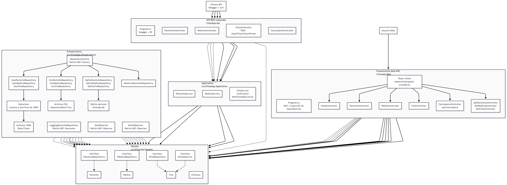

# Diagrama UML por capas de CitasApp

Este archivo documenta el diagrama UML por capas de **CitasApp**. El diagrama representa el estado real del proyecto, incluyendo la aplicación Web MVC, la API REST separada, las capas **Application**, **Domain** e **Infrastructure**, además de los patrones GOF implementados como **Factory**, **Decorator** y **Observer**.

---

## Vista previa del diagrama UML



---

## Código Mermaid del diagrama

```mermaid
flowchart TB
    Usuario["Usuario Web"]
    ClienteApi["Cliente API<br/>Swagger / curl"]

    subgraph Web["Presentación Web MVC<br/>CitasApp.Web"]
        direction TB
        WebProgram["Program.cs<br/>MVC + Inyección de dependencias"]
        HomeController["HomeController"]
        PacienteController["PacienteController"]
        MedicoController["MedicoController"]
        CitaController["CitaController"]
        WebCalculadora["CalculadoraController<br/>api/calculadora"]
        WebApiControllers["ApiPacientesController<br/>ApiMedicosController<br/>ApiCitasController"]
        Vistas["Razor Views<br/>wwwroot/js/panel-pruebas.js"]
    end

    subgraph Api["API REST separada<br/>CitasApp.Api"]
        direction TB
        ApiProgram["Program.cs<br/>Swagger + DI"]
        ApiPacientes["PacientesController"]
        ApiMedicos["MedicosController"]
        ApiCitas["CitasController<br/>POST /api/Citas/id/confirmar"]
        ApiCalculadora["CalculadoraController"]
    end

    subgraph Application["Application<br/>src/CitasApp.Application"]
        direction TB
        PacienteService["PacienteService"]
        MedicoService["MedicoService"]
        CitaService["CitaService<br/>Confirmar()<br/>NotificarObservers()"]
    end

    subgraph Domain["Domain<br/>src/CitasApp.Domain"]
        direction TB
        IPacienteRepository["interface<br/>IPacienteRepository"]
        IMedicoRepository["interface<br/>IMedicoRepository"]
        ICitaRepository["interface<br/>ICitaRepository"]
        ICitaObserver["interface<br/>ICitaObserver"]

        Paciente["Paciente"]
        Medico["Medico"]
        Cita["Cita"]
        CitaJson["CitaJson"]
    end

    subgraph Infrastructure["Infrastructure<br/>src/CitasApp.Infrastructure"]
        direction TB
        RepositoryFactory["RepositoryFactory<br/>Patrón GOF: Factory"]
        LoggingPacienteRepository["LoggingPacienteRepository<br/>Patrón GOF: Decorator"]

        JsonRepositories["JsonPacienteRepository<br/>JsonMedicoRepository<br/>JsonCitaRepository"]
        CsvRepositories["CsvPacienteRepository<br/>CsvMedicoRepository<br/>CsvCitaRepository"]
        SqliteRepositories["SqlitePacienteRepository<br/>SqliteMedicoRepository<br/>SqliteCitaRepository"]
        MemoriaPacienteRepository["MemoriaPacienteRepository"]

        DatosJson["DatosJson<br/>Lectura y escritura de JSON"]

        SmsObserver["SmsObserver<br/>Patrón GOF: Observer"]
        EmailObserver["EmailObserver<br/>Patrón GOF: Observer"]

        JsonData["Archivos JSON<br/>Data/*.json"]
        CsvData["Archivos CSV<br/>wwwroot/data/*.csv"]
        SqliteData["SQLite opcional<br/>citasapp.db"]
    end

    Usuario --> Vistas
    Vistas --> HomeController
    Vistas --> PacienteController
    Vistas --> MedicoController
    Vistas --> CitaController
    Vistas --> WebCalculadora
    Vistas --> WebApiControllers

    WebProgram -.-> IPacienteRepository
    WebProgram -.-> IMedicoRepository
    WebProgram -.-> ICitaRepository

    PacienteController --> IPacienteRepository
    MedicoController --> IMedicoRepository
    CitaController --> ICitaRepository
    CitaController --> IPacienteRepository
    CitaController --> IMedicoRepository
    WebApiControllers --> IPacienteRepository
    WebApiControllers --> IMedicoRepository
    WebApiControllers --> ICitaRepository

    ClienteApi --> ApiPacientes
    ClienteApi --> ApiMedicos
    ClienteApi --> ApiCitas
    ClienteApi --> ApiCalculadora

    ApiProgram -.-> PacienteService
    ApiProgram -.-> MedicoService
    ApiProgram -.-> CitaService
    ApiProgram -.-> ICitaObserver

    ApiPacientes --> PacienteService
    ApiMedicos --> MedicoService
    ApiCitas --> CitaService

    PacienteService --> IPacienteRepository
    MedicoService --> IMedicoRepository
    CitaService --> ICitaRepository
    CitaService --> ICitaObserver

    RepositoryFactory -.-> IPacienteRepository
    RepositoryFactory -.-> IMedicoRepository
    RepositoryFactory -.-> ICitaRepository
    RepositoryFactory --> JsonRepositories
    RepositoryFactory --> CsvRepositories
    RepositoryFactory --> SqliteRepositories
    RepositoryFactory --> MemoriaPacienteRepository

    LoggingPacienteRepository -.-> IPacienteRepository
    LoggingPacienteRepository --> IPacienteRepository

    JsonRepositories -.-> IPacienteRepository
    JsonRepositories -.-> IMedicoRepository
    JsonRepositories -.-> ICitaRepository

    CsvRepositories -.-> IPacienteRepository
    CsvRepositories -.-> IMedicoRepository
    CsvRepositories -.-> ICitaRepository

    SqliteRepositories -.-> IPacienteRepository
    SqliteRepositories -.-> IMedicoRepository
    SqliteRepositories -.-> ICitaRepository

    MemoriaPacienteRepository -.-> IPacienteRepository

    SmsObserver -.-> ICitaObserver
    EmailObserver -.-> ICitaObserver

    IPacienteRepository -.-> Paciente
    IMedicoRepository -.-> Medico
    ICitaRepository -.-> Cita
    ICitaObserver -.-> Cita

    JsonRepositories --> DatosJson
    DatosJson --> JsonData
    CsvRepositories --> CsvData
    SqliteRepositories --> SqliteData
```



---

## Descripción breve

El diagrama muestra la arquitectura real de **CitasApp** separada por capas. La Web MVC usa controladores, vistas Razor y repositorios CSV. La API REST separada usa servicios de aplicación y repositorios JSON. La capa Domain contiene modelos e interfaces. La capa Infrastructure implementa los repositorios y los patrones GOF utilizados en el proyecto.

---

## Patrones representados

### Factory

- RepositoryFactory

### Decorator

- LoggingPacienteRepository

### Observer

- ICitaObserver
- SmsObserver
- EmailObserver
- CitaService

---

## Ubicación recomendada

Este archivo debe colocarse en:

```text
docs/doc-UML/README.md
```

La imagen debe estar en:

```text
docs/doc-UML/assets/capturas/Diagrama-UML.png
```

Desde el README principal del proyecto, el enlace recomendado es:

```md
[Ver documentación UML de CitasApp](docs/doc-UML/README.md)
```
